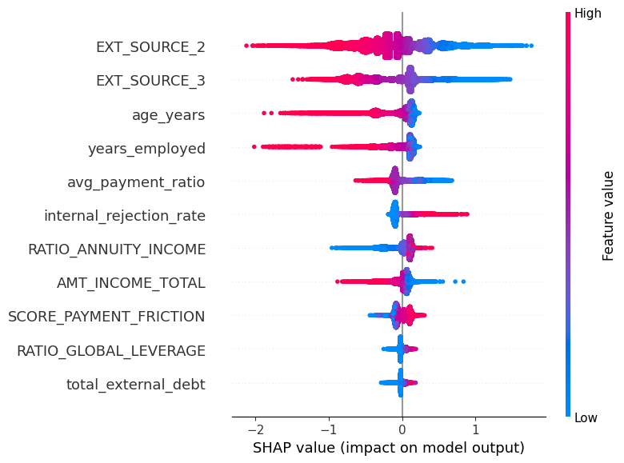

# Credit-Risk-Scorecard-Optimizacion-con-XGBoost
Pipeline profesional de riesgo crediticio que integra 4 fuentes de datos, ingeniería de variables financieras y un modelo de Machine Learning con restricciones monotónicas para una toma de decisiones auditable y transparente.

📂 Descripción del Proyecto
Este proyecto simula un entorno de producción bancaria para predecir el default de clientes. Se utilizaron datos de aplicaciones, historial en Buró de Crédito, pagos previos y rechazos internos para construir un modelo de scoring robusto.

🛠️ Tech Stack
Data Engine: DuckDB (Procesamiento SQL de alto rendimiento).

Modelado: XGBoost con monotone_constraints (Restricciones de negocio).

Explicabilidad: SHAP (Valores de Shapley para transparencia).

Validación: Scikit-learn (Métricas KS, Gini y AUC).

📈 Ingeniería de Variables (Features de Negocio)
Se crearon indicadores clave para la evaluación de riesgo:

Ratio Global Leverage: Exposición total de deuda vs. ingresos.

Payment Friction: Score de morosidad acumulada y retrasos en pagos.

Annuity Burden: Capacidad de pago mensual real.

## 📊 Resultados y Validación

En esta sección se presentan las métricas de desempeño del modelo XGBoost.

### Curva KS (Kolmogorov-Smirnov)
El modelo alcanzó un estadístico KS de **0.3416**, lo que indica una sólida capacidad de separación entre clientes sanos y morosos.

### Explicabilidad con SHAP
Para garantizar la transparencia del modelo (Explainable AI), se utilizaron valores SHAP para identificar los factores que más influyen en el riesgo. Se observa que los scores externos y el historial de rechazos internos son los predictores más potentes.

## 💰 Impacto de Negocio

Utilizando el punto de corte (threshold) óptimo de **0.468**, el modelo genera el siguiente valor:

| Concepto | Resultado | Impacto |
| :--- | :---: | :--- |
| **Clientes Sanos Aprobados** | 35,971 | Flujo de interés activo |
| **Defaults Evitados** | 3,502 | Ahorro de capital |
| **Detección de Morosidad** | 70.5% | Reducción de cartera vencida |
